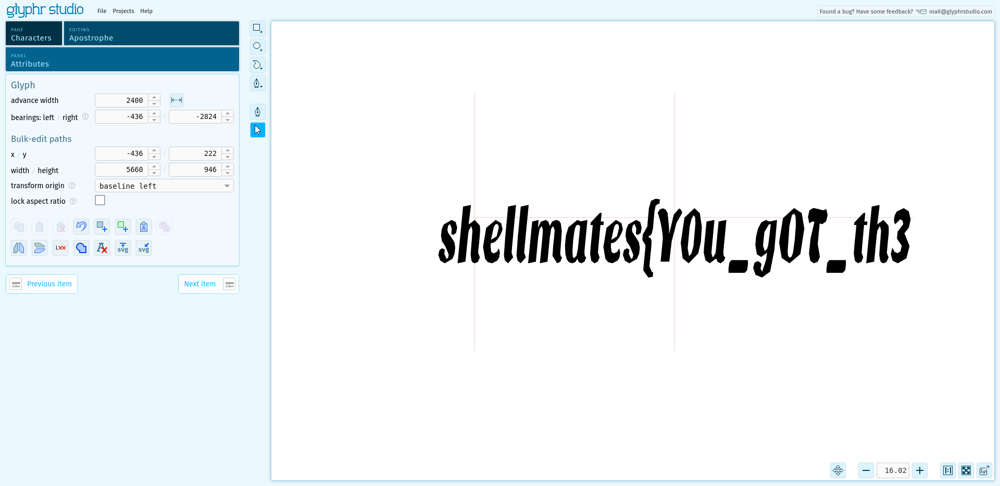
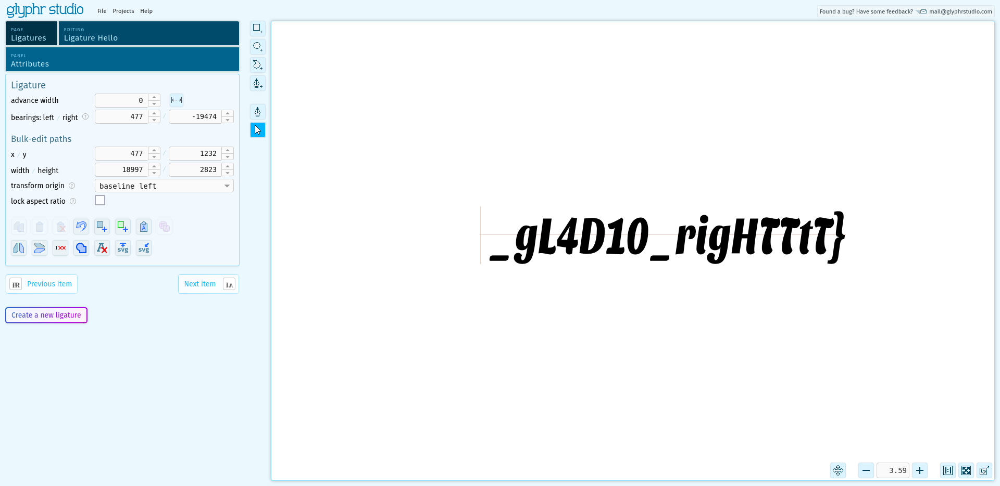

# gladios

## Write-up

- Check the font used in the textarea or by checking the css file.
- You will find out that the font name is gladios with the otf file format content.
- Make a check on the font file on any website eg: <a href="https://wakamaifondue.com/">https://wakamaifondue.com</a> or <a href="https://www.glyphrstudio.com/app/">https://www.glyphrstudio.com/app</a>
- Check the font details and you will find the flag parts, the first part is on the apostrophe `'` charachter and the second part is on a lignatures charachters called `Hello`.

## Flag

`shellmates{Y0u_g0T_th3_gL4D10_rigHTTtT}`